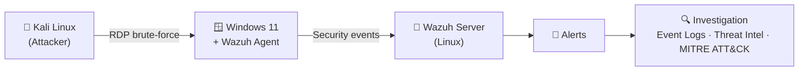

<div align="center">


<a href="https://git.io/typing-svg">
  
</a>

<br/>

[](https://www.linkedin.com/in/mohammad-maarouf-0aa527201)
[](https://tryhackme.com/p/HUNTERMAN)
[](mailto:m7mdmaarouf1@gmail.com)


</div>

---

## 👤 About Me

I'm a **cybersecurity graduate** (BSc Information Technology, University of Jeddah, 2022–2026) who started on the offensive side and moved to defense, because I'd rather be the one who **catches the attack**.

- 🔴 Started with offensive security (**eJPT**) to learn how attackers think
- 🔵 Moved to blue team: SIEM, log analysis, alert triage, incident investigation
- 🏢 Real-world exposure through a cybersecurity internship at **Saudia Cargo**
- 🧪 Built a **three-VM home SOC lab** where I attack, detect, and investigate
- 💼 **Looking for:** SOC Analyst L1 role

```text
> whoami
mohammed_maarouf

> role
SOC Analyst L1 candidate | Blue Team

> mindset
"In a world of threats, defenders are the last line."
```

---

## 🏆 Certifications

<div align="center">


<sub>eJPT · Jan 2026 &nbsp;|&nbsp; eCIR · May 2026 &nbsp;|&nbsp; eCDFP · Sep 2026 &nbsp;•&nbsp; Issued by INE Security</sub>

<table>
<tr>
<td align="center" width="33%">
<a href="assets/cert-ejpt.png"></a><br/>
<b>eJPT</b><br/><sub>Junior Penetration Tester · Jan 2026</sub>
</td>
<td align="center" width="33%">
<a href="assets/cert-ecir.png"></a><br/>
<b>eCIR</b><br/><sub>Certified Incident Responder · May 2026</sub>
</td>
<td align="center" width="33%">
<a href="assets/cert-ecdfp.png"></a><br/>
<b>eCDFP</b><br/><sub>Certified Digital Forensics Professional · Sep 2026</sub>
</td>
</tr>
</table>

*Issued by INE Security*

</div>

---

## 🧪 Featured Project: Home SOC Lab

A three-VM lab built to practice the full loop: **attack → log → alert → investigate**.



| Step | What I Did |
|---|---|
| 🏗️ **Build** | Deployed Kali Linux, Windows 11, and a Wazuh server on Linux |
| 🔌 **Connect** | Installed and configured the Wazuh agent on Windows and linked it to the server |
| ⚔️ **Attack** | Simulated RDP brute-force attempts from Kali against Windows |
| 🚨 **Detect** | Collected and analyzed the resulting security events and alerts in Wazuh |
| 🔍 **Investigate** | Traced activity using Windows Event Logs, threat intelligence, and MITRE ATT&CK |

**Skills demonstrated:** SIEM operations · alert triage · log analysis · attack simulation · ATT&CK mapping · incident documentation

> 📎 *Add your write-up link here: `[Read the full lab write-up →](YOUR_REPO_LINK)`*

---

## 🔗 Graduation Project: Malicious Link Checker (2025)

A web-based threat detection tool that scans **URLs, IP addresses, domains, and file hashes** for phishing, malware, and other malicious activity. It uses threat-intelligence-style reference lists and **rule-based security simulation** (results are clearly labelled as simulated in the UI) to give a verdict, a risk score, and a plain-language explanation.


**What it does**

- 🔐 **Authentication** via Firebase: Google, X (Twitter), or email/password sign-up and login
- 🔎 **Scanning** of URLs, IPs, domains, and file hashes, with input validation and a clear "not found" state
- 🎭 **Typosquatting detection:** flags look-alike domains such as `rnicrosoft.com` (an "rn" posing as an "m")
- 🧪 **Known-bad and test-URL matching:** recognizes high-risk domains and official security-test URLs (e.g. Google Safe Browsing malware test page)
- 📊 **Threat analysis report:** verdict, risk score out of 100, malicious / clean / unrated breakdown, community score, and detailed explanation
- 🗂️ **Scan history** with classification labels, timestamps, filtering, and delete / clear options

**Security testing:** Kali Linux and Burp Suite

<details open>
<summary><b>📸 Screenshots</b></summary>
<br/>

<table>
<tr>
<td align="center" width="50%">
<br/>
<sub><b>Authentication:</b> Google, X, or email</sub>
</td>
<td align="center" width="50%">
<br/>
<sub><b>Typosquatting detected:</b> <code>rnicrosoft.com</code> scored 95/100</sub>
</td>
</tr>
<tr>
<td align="center" width="50%">
<br/>
<sub><b>Malware test URL:</b> Google Safe Browsing test page flagged high risk</sub>
</td>
<td align="center" width="50%">
<br/>
<sub><b>High-risk domain:</b> matched against a research list</sub>
</td>
</tr>
<tr>
<td align="center" width="50%">
<br/>
<sub><b>Scan history:</b> classification, threat type, result, timestamps</sub>
</td>
<td align="center" width="50%">
<br/>
<sub><b>Input validation:</b> invalid input returns "Not Found"</sub>
</td>
</tr>
</table>

</details>

---

## 💼 Experience

### 🏢 Cybersecurity Intern, Saudia Cargo
`Jul 2025 – Sep 2025`

- Conducted web application security assessments aligned to the **OWASP Top 10** and **PortSwigger Web Security Academy** methodology
- Analyzed application behavior and identified security weaknesses using **Kali Linux, Burp Suite, and Nmap** from a defensive perspective
- Documented security observations and supported incident documentation and reporting workflows for the security team

---

## 🎯 Focus Areas

| Domain | What I've Worked On |
|---|---|
| 🔵 **SIEM & Log Analysis** | Windows Event Logs, Sysmon, Splunk / ELK / Wazuh |
| 🚨 **Alert Triage** | Reviewing alerts, validating activity, documenting findings |
| 🔎 **Threat Detection** | IOC identification, threat intelligence, MITRE ATT&CK mapping |
| 📋 **Incident Response** | Investigation workflows, incident documentation and reporting |
| 🌐 **Web App Security** | OWASP Top 10 assessments, Burp Suite, PortSwigger methodology |
| 🖥️ **Vulnerability Assessment** | Nmap scanning, information gathering, HTTP/HTTPS traffic analysis |

---

## 🛠️ Tools & Technologies

<div align="center">

### 🔵 Blue Team & SOC


### 🔎 Scanning & Analysis


### 💻 Operating Systems


### 📝 Programming


</div>

---

## 📈 GitHub Stats

<div align="center">


</div>

---

## 🤝 Let's Connect

I'm actively looking for a **SOC Analyst L1** position where I can apply alert triage, log analysis, investigation, and incident response in a real security operations environment, while learning from an experienced team.

<div align="center">

[](https://www.linkedin.com/in/mohammad-maarouf-0aa527201)
[](mailto:m7mdmaarouf1@gmail.com)


</div>
